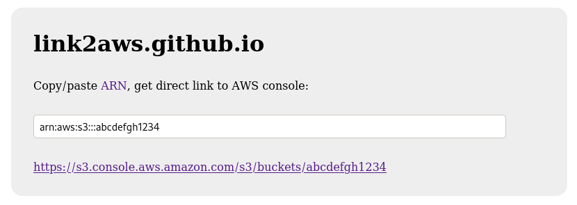

# link2aws

Copy/paste ARN, get direct link to AWS console

<a href="https://link2aws.github.io">

</a>

Copyright (c) 2020, Felix Kaiser. License: [ISC](https://spdx.org/licenses/ISC.html)


## How to...

### Use as website

Go to [link2aws.github.io](https://link2aws.github.io) (privacy notice: it runs in the browser and does *not* send your input anywhere)

Or run directly from source:

```sh
# git clone https://github.com/link2aws/link2aws.github.io
# firefox link2aws.github.io/index.html
```

You can make links that auto-redirect to the AWS console by appending `#arn...` like this:

https://link2aws.github.io/#arn:aws:ec2:us-west-1:136693071363:image/ami-0851c4af3ebd71c35


### Use as command line tool

Via NPM:

```sh
# npm install -g link2aws
# link2aws arn:aws:s3:::abcdefgh1234
https://s3.console.aws.amazon.com/s3/buckets/abcdefgh1234
```

Or clone the repo and run the file (no setup required):

```sh
# git clone https://github.com/link2aws/link2aws.github.io
# node link2aws.github.io/link2aws.js arn:aws:s3:::abcdefgh1234
https://s3.console.aws.amazon.com/s3/buckets/abcdefgh1234
```

### Use as JavaScript library

```js
var link2aws = require('link2aws');
new link2aws.ARN('arn:aws:s3:::abcdefgh1234').consoleLink
// https://s3.console.aws.amazon.com/s3/buckets/abcdefgh1234
```

Or:

```js
import { ARN } from 'link2aws';
new ARN('arn:aws:s3:::abcdefgh1234').consoleLink;
// https://s3.console.aws.amazon.com/s3/buckets/abcdefgh1234
```

If the ARN is invalid, or valid but we have no link for it, an exception is thrown.

### Add support for resource types

It's super easy - see [this example](https://github.com/link2aws/link2aws.github.io/commit/0432ecbbe522dbbd7e746caeeb4a7d1a6be5f057).

Pull requests welcome!

#### Add code

* Support for new resource types: see large dict at the end of `link2aws.js`
* Testcases...
    * ...where we should take a valid ARN and return a URL: `testcases/aws.json`
    * ...where we should take a string (e.g. bad or unsupported ARN) and throw an exception: `testcases/aws-negative.json`
    * ...for corner cases not specific to AWS, such as whitespace handling: `testcases/string.json`

#### Run tests and check test coverage

```
npm install
node_modules/nyc/bin/nyc.js --reporter=text node_modules/mocha/bin/mocha test/test.js
```